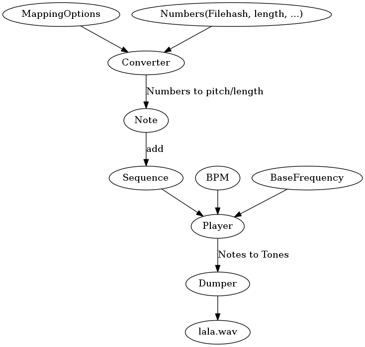

# Codesound #

# Works #

Add `Note` Objects to a `Sequence` which can be dumped into a wave file.


   REQUIRES "sox" http://sox.sourceforge.net/
   
   `sudo apt-get install sox`


The notes are indexed like this:

* 0 being A with 220 Hz
* 12 being A with 440 Hz
* 24 being A with 880 Hz

## Example ##

Play a simple A major scale

```
<?php 

$range = [0, 2, 4, 5, 7, 9, 11, 12];

$sequence = new Sequence();
foreach ($range as $index) {
    $note = new Note($index);
    $sequence->add($note);
}

$player = new Player();
$dumper = new SoundDumper();
$dumper->dump($player, __DIR__.'/bla.ul', __DIR__.'/bla.wav');

```

## How it works ##

Numbers are converted to `Note` objects.
They have an index of a note on the chromatic scale.
The also have a length given as quarter notes, half notes, ...
(The actual length of the sound is determinded by the BPM of the player, see below)

`Note` objects are added to a `Sequence` that holds all the notes.

A `Sequence` can be used in a `Player` where speed and base frequencey (default 220 Hz) can be adjusted.
With this information, the `Sequence` of `Notes` can be transformed into a list of `Tone` objects.
A `Tone` object has an actual length in miliseconds and a frequency in Hertz.

A `Dumper` can convert the list of `Tone` objects into a a actual media file.
`sox` is being used here.




## Use a Converter to transform numeric input into "music" ##

The `Converter`'s job is to turn given numeric input (file size, hash, lines of code, ...) into
Notes. By passing some options (TBD, how to map file size to lenght, ...) it will create `Note` instance
that can be added to a Sequence.


## TODO ##
Traverses a directory recursively and looks at the files.

Each file determines the Sound to play.

Size of the file determines the length of the sound.

Hash (md5) of the file determines the pitch.

To sound "reasonably harmonic", the hash is not translated into a frequency.

It translates into a note on the scale of A Major.
